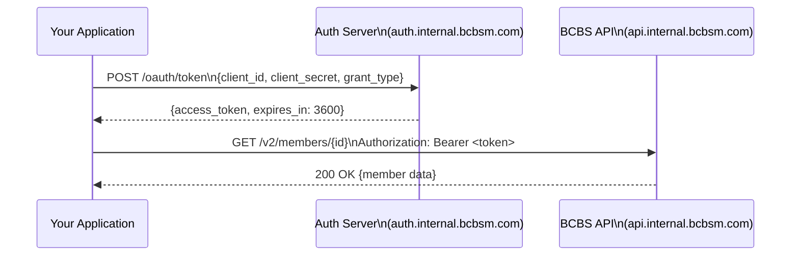

# Authentication Guide

All BCBS Michigan internal APIs use OAuth 2.0 with client credentials flow. Requests are authenticated with a short-lived bearer token.

## Authentication Flow



## Getting a Token

```bash
curl -X POST https://auth.internal.bcbsm.com/oauth/token \
  -H "Content-Type: application/x-www-form-urlencoded" \
  -d "grant_type=client_credentials" \
  -d "client_id=YOUR_CLIENT_ID" \
  -d "client_secret=YOUR_CLIENT_SECRET" \
  -d "scope=members:read claims:read providers:read"
```

**Response:**
```json
{
  "access_token": "eyJhbGciOiJSUzI1NiJ9...",
  "token_type": "Bearer",
  "expires_in": 3600,
  "scope": "members:read claims:read providers:read"
}
```

## Token Lifespan & Refresh

Tokens expire after **1 hour**. Your application should:
1. Cache the token and reuse it until it expires
2. Request a new token 5 minutes before expiry
3. Never hardcode tokens in source code — use a secrets manager


Tokens are credentials. Do not log them, commit them to source control, or share them in Slack/email. Rotate compromised tokens immediately via the API Gateway console.


## Available Scopes

| Scope | Access |
|---|---|
| `members:read` | Read member eligibility and demographics |
| `members:write` | Update member contact information |
| `claims:read` | Query claim status |
| `claims:submit` | Submit new claims |
| `providers:read` | Search provider directory |
