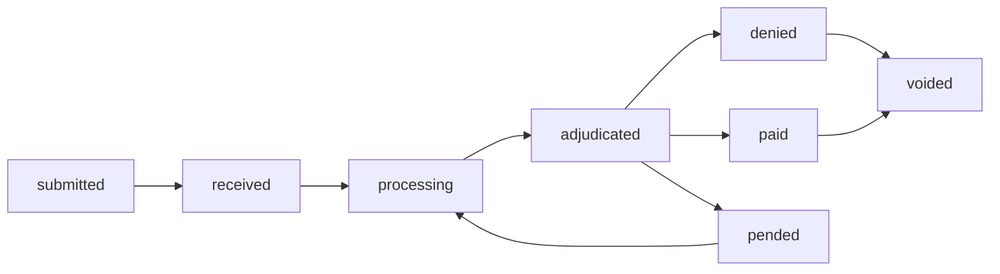

# Claims API — Overview

The Claims API enables electronic claim submission, real-time status queries, and claim updates for authorized trading partners and internal systems.

## Key Capabilities

- **Electronic claim submission** — 837P (professional) and 837I (institutional) formats
- **Real-time status** — query claim status within seconds of adjudication
- **Claim search** — filter by member, date range, provider, or status
- **Remittance data** — retrieve 835 ERA data for reconciliation
- **Void and resubmit** — correct claims within the allowed resubmission window

## Base Path

```
/v2/claims
```

## Claim Lifecycle



## Required Scopes

| Operation | Scope |
|---|---|
| Query claim status | `claims:read` |
| Submit a claim | `claims:submit` |
| Void a claim | `claims:submit` |
| Access ERA/remittance | `claims:remittance` |
