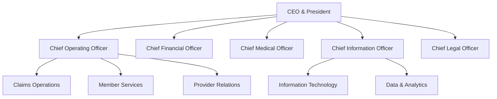

# Organizational Structure

## Leadership Teams

BCBS Michigan is organized into the following major divisions:

## Key Departments

| Division | Responsibilities | Head of Department |
|---|---|---|
| **Claims Operations** | Claims adjudication, appeals, fraud detection | VP, Claims |
| **Member Services** | Member support, enrollment, benefits administration | VP, Member Experience |
| **Provider Relations** | Network management, provider contracting | VP, Network Strategy |
| **Information Technology** | Infrastructure, applications, security | CIO |
| **Data & Analytics** | Reporting, actuarial, business intelligence | VP, Data |
| **Compliance & Legal** | Regulatory compliance, legal affairs | CLO |
| **Finance** | Budgeting, accounting, actuarial | CFO |
| **Human Resources** | Talent, benefits, workforce development | CHRO |

## Finding People

Use the **Microsoft 365 People Directory** (`people.bcbsm.com`) to search for colleagues by name, department, or role. The directory is updated nightly from Workday.
