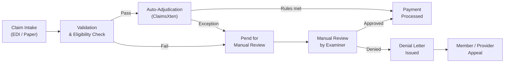

# Claims Operations Guide

Reference guide for the Claims Operations team covering daily workflows, systems, and escalation paths.

## System Access

| System | Purpose | Access Level |
|---|---|---|
| **Facets** | Core claims platform — adjudication and payment | Role-based; request via ServiceNow |
| **ClaimsXten** | Auto-adjudication rules engine | Read access for analysts; write for supervisors |
| **Overpayment Tracker** | Recovery workflow management | Claims supervisors and finance |
| **Member 360** | Member eligibility and benefit lookup | All claims staff |

## Daily Workflow Overview

## Key Metrics & Targets

| Metric | Target |
|---|---|
| Clean claim auto-adjudication rate | ≥ 92% |
| Average processing time (clean claim) | ≤ 14 calendar days |
| Pend rate | ≤ 8% |
| First-level appeal overturn rate | ≤ 25% |

## Escalation Paths

| Situation | Escalate To |
|---|---|
| Suspected fraud or abuse | Special Investigations Unit (SIU) — x5500 |
| High-dollar claim (> $50k) | Senior Examiner review required |
| Coordination of Benefits dispute | COB specialist team |
| CMS/Medicare claim issue | Government Programs team |
| System outage | IT Helpdesk x4357, then supervisor |
